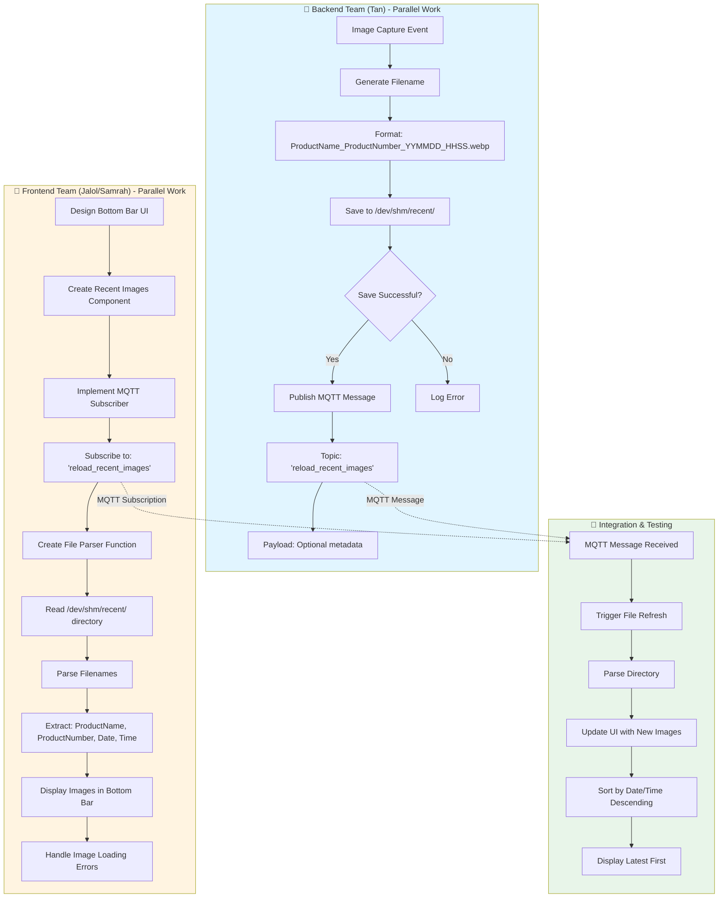

# GUI Bottom Bar Implementation Plan

**Date:** January 20, 2026  
**Teams:** Backend (Tan) + Frontend (Jalol/Samrah) - Parallel Implementation

---

## Overview

This document outlines the implementation plan for adding a bottom bar to the GUI that displays recent product images. The backend and frontend teams will work in parallel.

---

## Mermaid Diagram



---

## Implementation Details

### Backend Implementation (Tan)

#### 1. Image Saving Logic
- **Directory:** `/dev/shm/recent/`
- **Filename Format:** `ProductName_ProductNumber_YYMMDD_HHSS.webp`
  - Example: `XD5-40D_380_240120_1430.webp`
  - Format breakdown:
    - `ProductName`: Product identifier (e.g., XD5-40D)
    - `ProductNumber`: Product number (e.g., 380)
    - `YYMMDD`: Date in YYMMDD format (e.g., 240120 for Jan 20, 2024)
    - `HHSS`: Time in HHSS format (e.g., 1430 for 14:30)

#### 2. MQTT Publishing
- **Topic:** `reload_recent_images`
- **Payload (Optional):** Can include metadata like:
  ```json
  {
    "filename": "XD5-40D_380_240120_1430.webp",
    "timestamp": "2024-01-20T14:30:00",
    "product_name": "XD5-40D",
    "product_number": "380"
  }
  ```
- **Trigger:** Immediately after successful file save

#### 3. Error Handling
- Log errors if file save fails
- Do not send MQTT message if save fails
- Ensure directory exists before saving

---

### Frontend Implementation (Jalol/Samrah)

#### 1. Bottom Bar UI Design
- **Location:** Bottom of the GUI window
- **Layout:** Horizontal scrollable image gallery
- **Features:**
  - Display recent product images (e.g., last 10-20 images)
  - Show product name/number on hover or as overlay
  - Click to view full-size image
  - Auto-refresh when MQTT message received

#### 2. MQTT Subscription
- **Topic:** `reload_recent_images`
- **Action on Receive:** Trigger directory refresh
- **Connection:** Ensure MQTT client is connected and subscribed

#### 3. File Parsing Function
```javascript
// Pseudo-code structure
function parseRecentImages() {
  1. Read /dev/shm/recent/ directory
  2. Filter for .webp files
  3. Parse filenames to extract:
     - ProductName
     - ProductNumber
     - Date (YYMMDD)
     - Time (HHSS)
  4. Sort by date/time (newest first)
  5. Return array of image objects
}
```

#### 4. Image Display Logic
- Load images from `/dev/shm/recent/` directory
- Handle missing or corrupted images gracefully
- Show loading state while parsing
- Update UI incrementally as images load

#### 5. Error Handling
- Handle MQTT connection failures
- Handle directory read errors
- Handle image loading errors
- Show user-friendly error messages

---

## Parallel Work Plan

### Phase 1: Setup (Day 1)
**Backend (Tan):**
- [ ] Create `/dev/shm/recent/` directory structure
- [ ] Implement filename generation function
- [ ] Test file saving with sample images

**Frontend (Jalol/Samrah):**
- [ ] Design bottom bar UI mockup
- [ ] Set up MQTT client connection
- [ ] Create basic bottom bar component structure

### Phase 2: Core Implementation (Day 2-3)
**Backend (Tan):**
- [ ] Implement image saving to `/dev/shm/recent/`
- [ ] Implement MQTT publisher
- [ ] Test with real product images
- [ ] Add error handling and logging

**Frontend (Jalol/Samrah):**
- [ ] Implement MQTT subscriber
- [ ] Implement file parser function
- [ ] Create image gallery component
- [ ] Add image loading and display logic

### Phase 3: Integration (Day 4)
**Both Teams:**
- [ ] Integration testing
- [ ] Verify MQTT communication
- [ ] Test file parsing accuracy
- [ ] UI/UX refinement
- [ ] Error handling verification

### Phase 4: Testing & Refinement (Day 5)
**Both Teams:**
- [ ] End-to-end testing
- [ ] Performance optimization
- [ ] Edge case handling
- [ ] User acceptance testing

---

## Technical Specifications

### File Naming Convention
```
Format: ProductName_ProductNumber_YYMMDD_HHSS.webp

Examples:
- XD5-40D_380_240120_1430.webp
- SRP-S300-BZR_2024_240120_0915.webp
- XD3-40D_500_240120_1625.webp
```

### MQTT Topic Structure
```
Topic: reload_recent_images
QoS: 1 (At least once delivery)
Retain: false
```

### Directory Structure
```
/dev/shm/recent/
├── XD5-40D_380_240120_1430.webp
├── XD5-40D_380_240120_1435.webp
├── SRP-S300-BZR_2024_240120_0915.webp
└── ...
```

---

## Dependencies

### Backend (Tan)
- MQTT client library
- File system access to `/dev/shm/recent/`
- Image processing/saving capability

### Frontend (Jalol/Samrah)
- MQTT client library (same as backend or compatible)
- File system access to `/dev/shm/recent/` (via API or direct access)
- Image display components
- UI framework components

---

## Testing Checklist

### Backend Testing
- [ ] Files saved with correct naming format
- [ ] MQTT message sent after successful save
- [ ] Error handling for failed saves
- [ ] Directory creation if not exists
- [ ] Concurrent file saves handled correctly

### Frontend Testing
- [ ] MQTT subscription working
- [ ] File parsing extracts correct information
- [ ] Images display correctly
- [ ] UI updates on MQTT message
- [ ] Error handling for missing/corrupted images
- [ ] Performance with many images
- [ ] Sorting by date/time works correctly

### Integration Testing
- [ ] End-to-end flow works
- [ ] Real-time updates work
- [ ] Multiple rapid saves handled
- [ ] Network issues handled gracefully

---

## Notes

1. **Shared Memory:** `/dev/shm/` is a RAM-based filesystem, so files are temporary and will be lost on reboot. Consider if persistence is needed.

2. **File Cleanup:** May need to implement cleanup logic to prevent directory from growing too large.

3. **Security:** Ensure proper file permissions on `/dev/shm/recent/` directory.

4. **Performance:** Consider limiting the number of images displayed in the bottom bar (e.g., last 20 images).

5. **Error Recovery:** Both teams should implement retry logic for MQTT and file operations.

---

**Last Updated:** January 20, 2026

