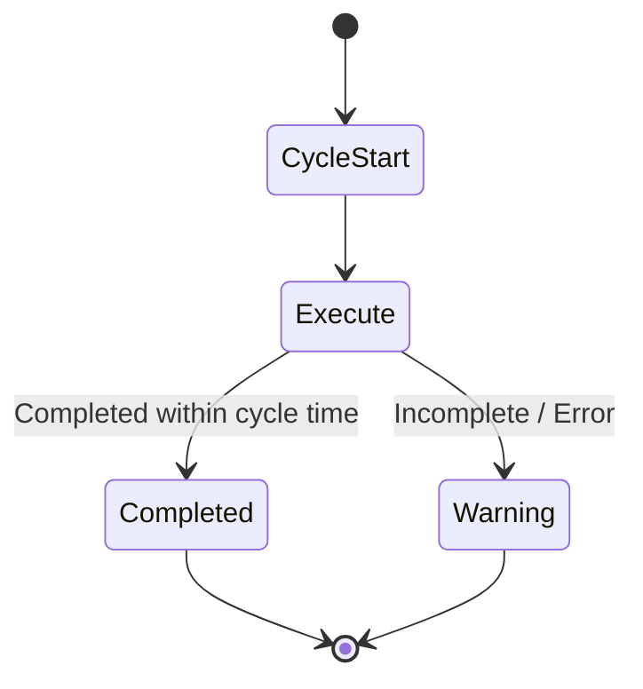
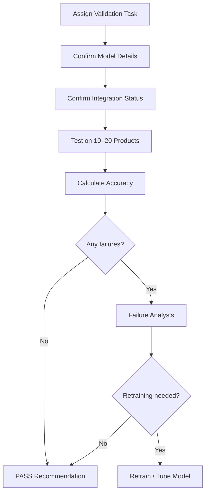

# Processes & Acceptance

## Acceptance

**Acceptance Rules**
- Each robot is evaluated independently
- Completion within cycle time = PASS
- Any incomplete cycle = WARNING

---

## Vision Validation Workflow

Vision validation is treated as a production-readiness gate and is performed on 10–20 real products per system.

**Validation Output**
- Robot system name
- Vision model name and version
- Integration status
- Accuracy results
- Failure cases and root cause
- Pass / Fail conclusion

---

[← Back to Overview](./README.md)

