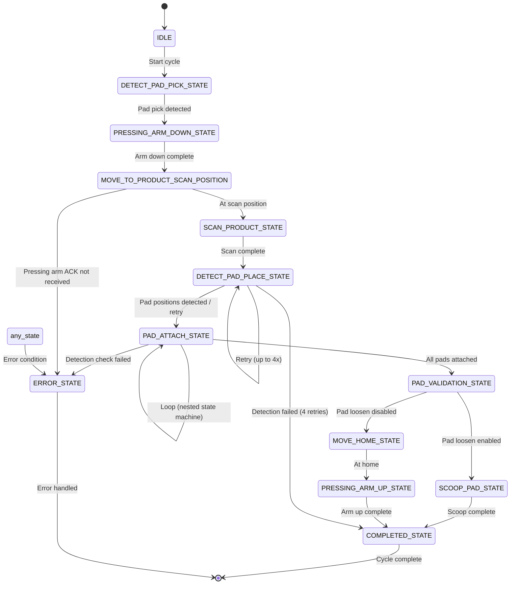
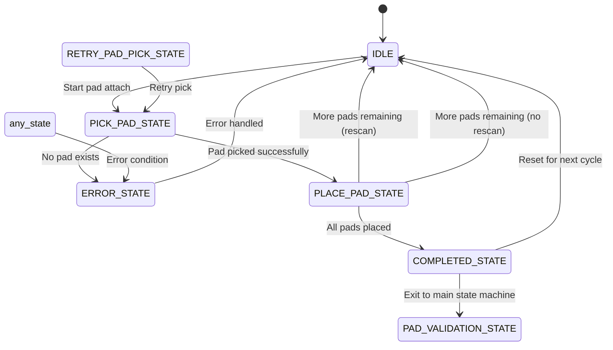
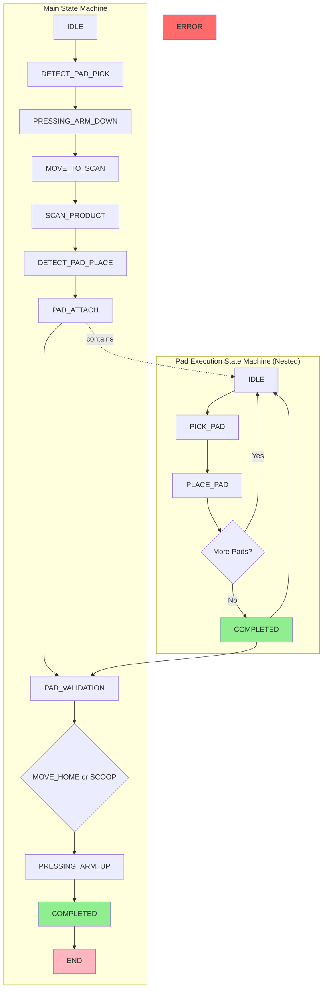
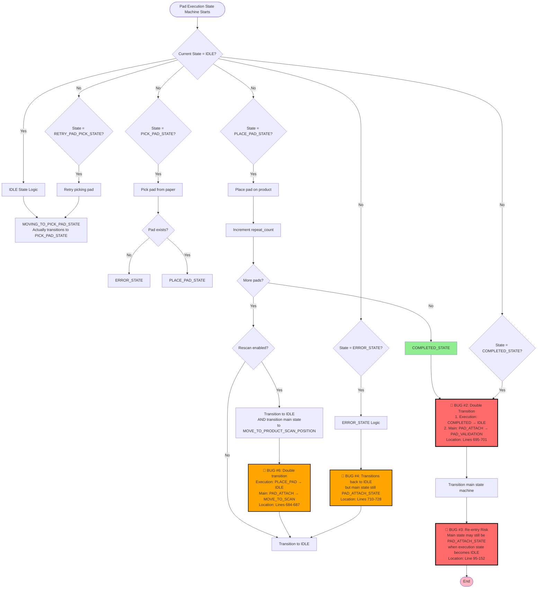
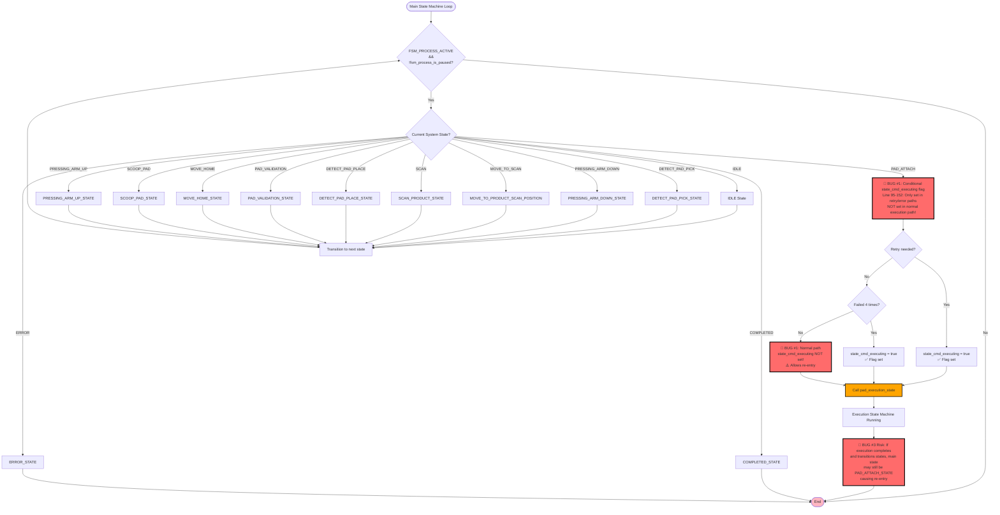

# Rubber Robot State Machine Diagram

## Main State Machine (`rubber_state_machine`)

## Pad Execution State Machine (`pad_execution_state`)

## Combined Flow Diagram

## Pad Execution State Machine Detailed Flowchart with Bug Locations

## Main State Machine Entry Point with Bug Location

