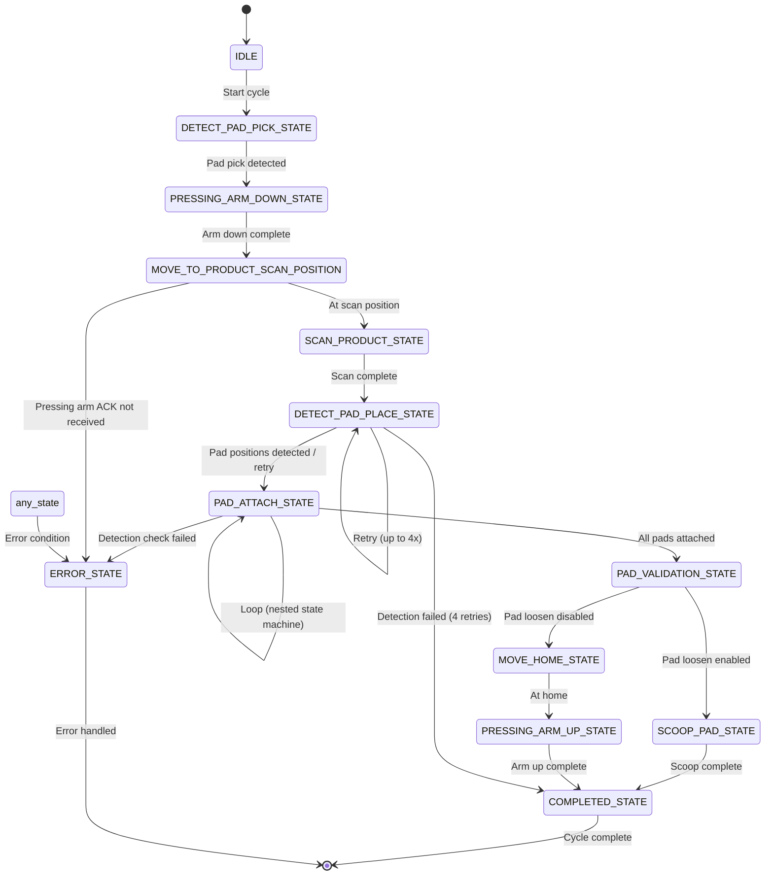
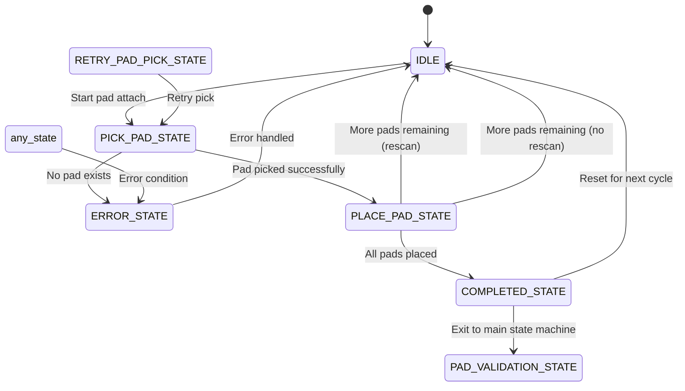
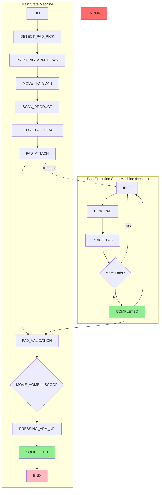

# Rubber Robot State Machine Diagram

## Main State Machine (`rubber_state_machine`)

```mermaid
stateDiagram-v2
    [*] --> IDLE
    
    IDLE --> DETECT_PAD_PICK_STATE: Start cycle
    DETECT_PAD_PICK_STATE --> PRESSING_ARM_DOWN_STATE: Pad pick detected
    PRESSING_ARM_DOWN_STATE --> MOVE_TO_PRODUCT_SCAN_POSITION: Arm down complete
    MOVE_TO_PRODUCT_SCAN_POSITION --> SCAN_PRODUCT_STATE: At scan position
    SCAN_PRODUCT_STATE --> DETECT_PAD_PLACE_STATE: Scan complete
    DETECT_PAD_PLACE_STATE --> PAD_ATTACH_STATE: Pad positions detected / retry
    PAD_ATTACH_STATE --> PAD_ATTACH_STATE: Loop (nested state machine)
    PAD_ATTACH_STATE --> PAD_VALIDATION_STATE: All pads attached
    PAD_VALIDATION_STATE --> SCOOP_PAD_STATE: Pad loosen enabled
    PAD_VALIDATION_STATE --> MOVE_HOME_STATE: Pad loosen disabled
    SCOOP_PAD_STATE --> COMPLETED_STATE: Scoop complete
    MOVE_HOME_STATE --> PRESSING_ARM_UP_STATE: At home
    PRESSING_ARM_UP_STATE --> COMPLETED_STATE: Arm up complete
    COMPLETED_STATE --> [*]: Cycle complete
    
    DETECT_PAD_PLACE_STATE --> DETECT_PAD_PLACE_STATE: Retry (up to 4x)
    DETECT_PAD_PLACE_STATE --> COMPLETED_STATE: Detection failed (4 retries)
    PAD_ATTACH_STATE --> ERROR_STATE: Detection check failed
    MOVE_TO_PRODUCT_SCAN_POSITION --> ERROR_STATE: Pressing arm ACK not received
    
    any_state --> ERROR_STATE: Error condition
    ERROR_STATE --> [*]: Error handled
```

## Pad Execution State Machine (`pad_execution_state`)

```mermaid
stateDiagram-v2
    [*] --> IDLE
    
    IDLE --> PICK_PAD_STATE: Start pad attach
    PICK_PAD_STATE --> ERROR_STATE: No pad exists
    PICK_PAD_STATE --> PLACE_PAD_STATE: Pad picked successfully
    PLACE_PAD_STATE --> IDLE: More pads remaining (rescan)
    PLACE_PAD_STATE --> IDLE: More pads remaining (no rescan)
    PLACE_PAD_STATE --> COMPLETED_STATE: All pads placed
    COMPLETED_STATE --> IDLE: Reset for next cycle
    COMPLETED_STATE --> PAD_VALIDATION_STATE: Exit to main state machine
    
    RETRY_PAD_PICK_STATE --> PICK_PAD_STATE: Retry pick
    ERROR_STATE --> IDLE: Error handled
    
    any_state --> ERROR_STATE: Error condition
```

## Combined Flow Diagram

```mermaid
graph TB
    subgraph "Main State Machine"
        A[IDLE] --> B[DETECT_PAD_PICK]
        B --> C[PRESSING_ARM_DOWN]
        C --> D[MOVE_TO_SCAN]
        D --> E[SCAN_PRODUCT]
        E --> F[DETECT_PAD_PLACE]
        F --> G[PAD_ATTACH]
        G --> H[PAD_VALIDATION]
        H --> I{MOVE_HOME or SCOOP}
        I --> J[PRESSING_ARM_UP]
        J --> K[COMPLETED]
        K --> L[END]
    end
    
    subgraph "Pad Execution State Machine (Nested)"
        G1[IDLE] --> G2[PICK_PAD]
        G2 --> G3[PLACE_PAD]
        G3 --> G4{More Pads?}
        G4 -->|Yes| G1
        G4 -->|No| G5[COMPLETED]
        G5 --> G1
        G5 --> H
    end
    
    G -.contains.-> G1
    
    style K fill:#90EE90
    style L fill:#FFB6C1
    style G5 fill:#90EE90
    style ERROR fill:#FF6B6B
```

