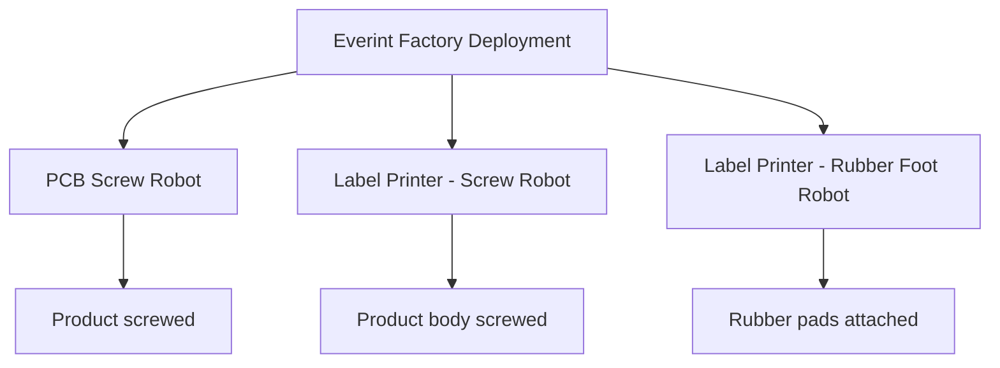
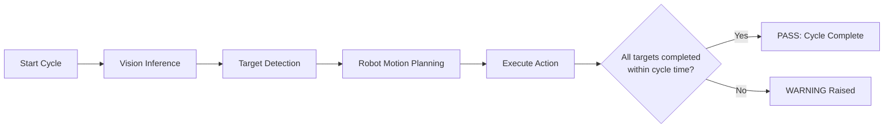

# Robotic Systems

## Robotic Systems in Scope

### 2.1 PCB Screw Robot
**Function**
- Scan product
- Identify screw holes
- Perform automated screwing

**Status**
- Almost complete and running
- Used as a reference system for other robots
- Team members (Ammad, Tan) are now helping other robot systems

**Team**
- Robot / Framework: Ammad  
- Vision: Tan  
- Backend: Jalol  
- Frontend: Samrah  

---

### 2.2 Label Printer – Screw Robot
**Function**
- Identify screw holes on product body
- Perform screwing operation on product body

**Current Status**
- Main robot: Operational  
- New robot (FR3): Installed  
- CoE / Framework: Integrated  
- Robot teaching: In progress  

**Team**
- Robot / Framework: Hieu  
- Vision: Rizwan, Shams  
- Backend: Jalol  
- Frontend: Samrah  

---

### 2.3 Label Printer – Rubber Foot Robot
**Function**
- Attach rubber pads to the product body
- Placed after Label Printer Screw Robot in the production line

**Current Status**
- Main robot: Operational  
- New robot (FR3): Installed  
- CoE / Framework: Integrated  
- Robot teaching: Completed  
- Vision model testing: In progress  

**Team**
- Robot / Framework: Tugi  
- Vision: Rizwan, Sajjad  
- Backend: Jalol  
- Frontend: Samrah  

---

## High-Level System Architecture

---

## Common Operational Flow (All Robots)

All robot systems follow the same execution logic:

---

[← Back to Overview](./README.md)

