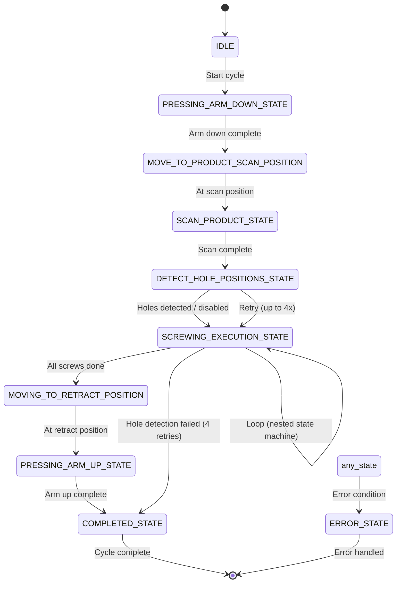
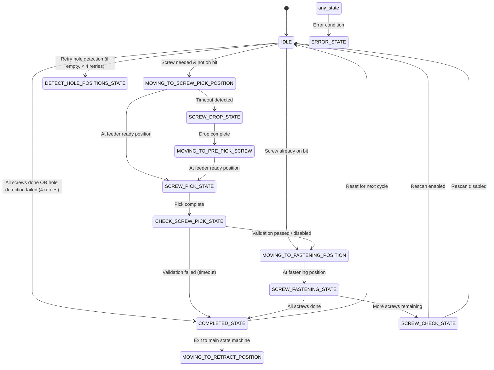
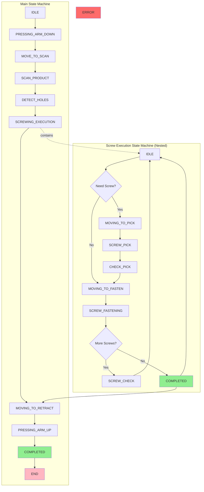

# Screw Robot State Machine Diagram

## Main State Machine (`screw_state_machine`)



## Screw Execution State Machine (`screw_execution_state`)



## Combined Flow Diagram



## Potential Issues Identified

### 🔴 Issue 1: Missing `state_cmd_executing` flag in SCREWING_EXECUTION_STATE
**Location:** Line 103
```cpp
// state_cmd_executing.store(true);  // COMMENTED OUT!
```
**Problem:** The main state machine's `SCREWING_EXECUTION_STATE` doesn't set the execution flag, which could cause race conditions or allow the state to be re-entered incorrectly.

### 🔴 Issue 2: COMPLETED_STATE transition logic
**Location:** Lines 628-634
**Problem:** The `COMPLETED_STATE` in the execution state machine:
1. Transitions back to `IDLE` 
2. Then transitions the main state machine to `MOVING_TO_RETRACT_POSITION`

This double transition could cause issues if the state machine is checked between these two commands.

### 🔴 Issue 3: Hole detection retry logic
**Location:** Lines 300-328
**Problem:** When hole detection fails, it transitions back to `DETECT_HOLE_POSITIONS_STATE` in the main state machine, but the execution state machine's `IDLE` state is still active. This could cause state confusion.

### 🔴 Issue 4: SCREW_CHECK_STATE transition
**Location:** Lines 598-626
**Problem:** `SCREW_CHECK_STATE` always transitions to `IDLE` regardless of whether rescan is enabled or not. If rescan is enabled, it also triggers hole detection which might transition the main state machine, causing potential conflicts.

### 🔴 Issue 5: No explicit ERROR_STATE handling in execution state machine
**Location:** Throughout `screw_execution_state()`
**Problem:** While `ERROR_STATE` exists in the enum, there's no explicit handling for it in the execution state machine, only a catch-all `else` clause that logs "unknown state".

## Recommended Fixes

1. **Uncomment the `state_cmd_executing` flag** in `SCREWING_EXECUTION_STATE`
2. **Review COMPLETED_STATE transitions** - ensure atomic state transitions
3. **Add explicit ERROR_STATE handling** in the execution state machine
4. **Clarify SCREW_CHECK_STATE logic** - ensure proper state synchronization
5. **Add state validation** before transitions to prevent invalid state combinations

