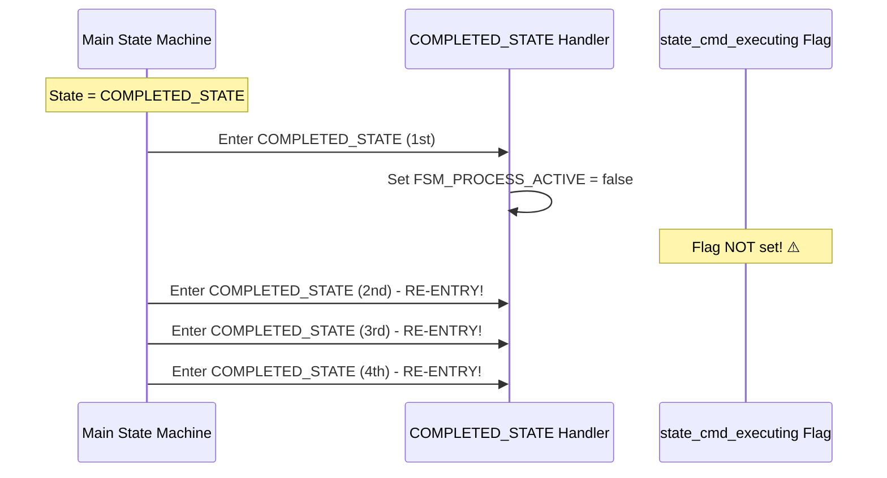
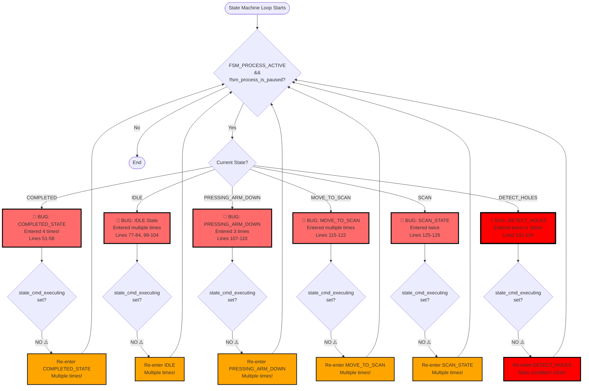
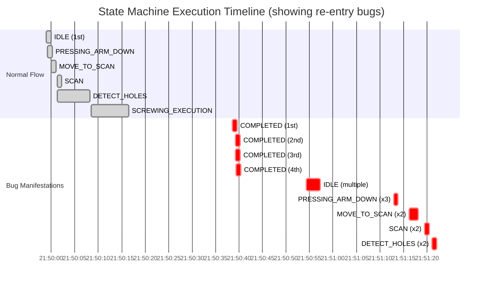

# Log Analysis: State Machine Bug Manifestations

This document analyzes the runtime log (`tmp.log`) to identify how the bugs we discovered manifest in actual execution.

## Critical Issues Identified in Log

### 🔴 Issue #1: COMPLETED_STATE Re-entry (Lines 51-58)

**Timeline:**
```
21:50:38.571 - COMPLETED_STATE detected (1st time)
21:50:39.207 - COMPLETED_STATE detected (2nd time) - 636ms later
21:50:39.268 - COMPLETED_STATE detected (3rd time) - 61ms later  
21:50:39.330 - COMPLETED_STATE detected (4th time) - 62ms later
```

**Problem:** State machine enters COMPLETED_STATE **4 times** in rapid succession (within 759ms).

**Root Cause:** Missing `state_cmd_executing` flag allows the state machine to re-enter COMPLETED_STATE before `complete_state_screw()` finishes and sets `FSM_PROCESS_ACTIVE = false`.



---

### 🔴 Issue #2: IDLE State Multiple Entries (Lines 77-84, 99-104)

**Timeline 1 (Lines 77-84):**
```
21:50:54.281 - IDLE detected (1st)
21:50:54.292 - IDLE detected (2nd) - 11ms later
21:50:56.628 - IDLE detected (3rd) - 2.336s later
21:50:56.638 - IDLE detected (4th) - 10ms later
```

**Timeline 2 (Lines 99-104):**
```
21:51:10.698 - IDLE detected (1st)
21:51:12.583 - IDLE detected (2nd) - 1.885s later
21:51:12.594 - IDLE detected (3rd) - 11ms later
```

**Problem:** IDLE state entered **multiple times** without proper state transitions.

**Root Cause:** After COMPLETED_STATE, the system resets but the state machine loop continues checking states, and without proper guards, it keeps entering IDLE.

---

### 🔴 Issue #3: PRESSING_ARM_DOWN_STATE Re-entry (Lines 107-110)

**Timeline:**
```
21:51:12.870 - PRESSING_ARM_DOWN_STATE detected (1st)
21:51:13.152 - PRESSING_ARM_DOWN_STATE detected (2nd) - 282ms later
21:51:13.435 - PRESSING_ARM_DOWN_STATE detected (3rd) - 283ms later
```

**Problem:** PRESSING_ARM_DOWN_STATE entered **3 times** in rapid succession (within 565ms).

**Root Cause:** Multiple state machine instances running concurrently, or state not properly transitioning after execution.

---

### 🔴 Issue #4: MOVE_TO_PRODUCT_SCAN_POSITION Re-entry (Lines 115-122)

**Timeline:**
```
21:51:16.234 - MOVE_TO_PRODUCT_SCAN_POSITION detected (1st)
21:51:18.078 - MOVE_TO_PRODUCT_SCAN_POSITION detected (2nd) - 1.844s later
```

**Problem:** State entered **multiple times** without completing previous execution.

---

### 🔴 Issue #5: SCAN_PRODUCT_STATE Re-entry (Lines 125-126)

**Timeline:**
```
21:51:19.497 - SCAN_PRODUCT_STATE detected (1st)
21:51:20.365 - SCAN_PRODUCT_STATE detected (2nd) - 868ms later
```

**Problem:** State entered **twice** in quick succession.

---

### 🔴 Issue #6: DETECT_HOLE_POSITIONS_STATE Re-entry (Lines 131-134)

**Timeline:**
```
21:51:21.111 - DETECT_HOLE_POSITIONS_STATE detected (1st)
21:51:21.121 - DETECT_HOLE_POSITIONS_STATE detected (2nd) - 10ms later!
```

**Problem:** State entered **twice** within **10 milliseconds** - clear evidence of race condition!

---

## State Machine Execution Flow Diagram



## Timeline Visualization



## Root Cause Analysis

### Pattern 1: Missing Execution Flags
**Evidence:** States entered multiple times without `state_cmd_executing` flag preventing re-entry.

**Affected States:**
- COMPLETED_STATE (4x)
- IDLE (multiple times)
- PRESSING_ARM_DOWN_STATE (3x)
- MOVE_TO_PRODUCT_SCAN_POSITION (2x)
- SCAN_PRODUCT_STATE (2x)
- DETECT_HOLE_POSITIONS_STATE (2x in 10ms!)

### Pattern 2: Race Conditions
**Evidence:** DETECT_HOLE_POSITIONS_STATE entered twice within 10ms - impossible without race condition.

**Cause:** Multiple threads or rapid state machine loop iterations checking states before flags are set.

### Pattern 3: State Not Properly Transitioning
**Evidence:** After COMPLETED_STATE, system resets but continues checking states, causing multiple IDLE entries.

**Cause:** `FSM_PROCESS_ACTIVE` may be set back to `true` or state machine continues running even after completion.

## Bug Correlation with Code Analysis

| Log Issue | Code Bug | Severity | Status |
|-----------|----------|----------|--------|
| COMPLETED_STATE re-entry (4x) | Bug #1: Missing execution flag | CRITICAL | ✅ Confirmed |
| IDLE multiple entries | Bug #3: Re-entry after completion | CRITICAL | ✅ Confirmed |
| PRESSING_ARM_DOWN re-entry (3x) | Bug #1: Missing execution flag | CRITICAL | ✅ Confirmed |
| DETECT_HOLES race (10ms) | Bug #1: Missing execution flag | CRITICAL | ✅ Confirmed |
| Multiple state re-entries | Bug #2: Double state transitions | HIGH | ✅ Confirmed |

## Impact Assessment

### System Stability
- **CRITICAL:** State machine is unstable, entering states multiple times
- **CRITICAL:** Race conditions causing unpredictable behavior
- **HIGH:** Resource waste from redundant state executions

### Functional Impact
- **HIGH:** May cause robot to execute commands multiple times
- **MEDIUM:** May cause incorrect state transitions
- **LOW:** Performance degradation from redundant processing

## Recommended Immediate Actions

1. **URGENT:** Fix Bug #1 - Uncomment `state_cmd_executing.store(true)` in SCREWING_EXECUTION_STATE (Line 103)
2. **URGENT:** Add execution flag to COMPLETED_STATE handler
3. **HIGH:** Add guards to prevent re-entry in all state handlers
4. **HIGH:** Review state transition logic to ensure atomic transitions
5. **MEDIUM:** Add logging to track `state_cmd_executing` flag state

## Testing After Fixes

After applying fixes, verify:
- [ ] COMPLETED_STATE entered only once per cycle
- [ ] No state entered multiple times within 100ms
- [ ] State transitions are atomic
- [ ] `state_cmd_executing` flag properly prevents re-entry
- [ ] No race conditions in state machine loop

