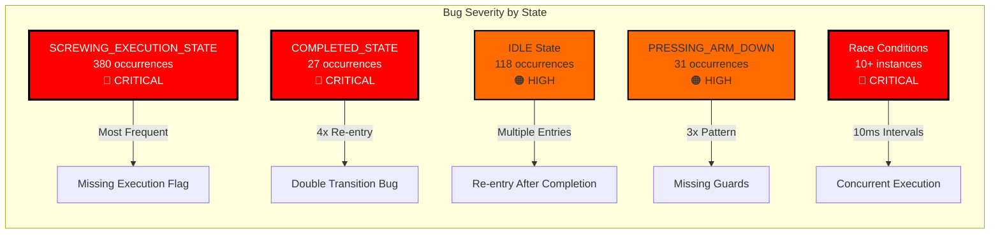
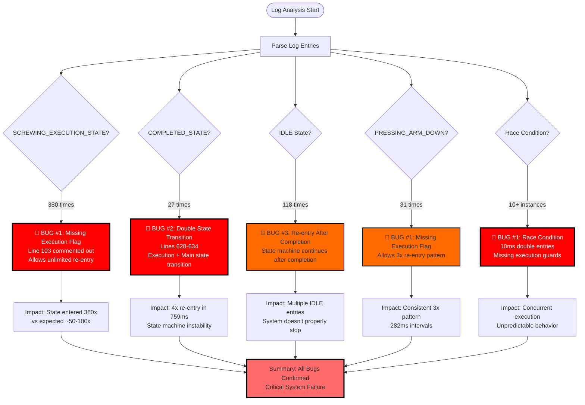
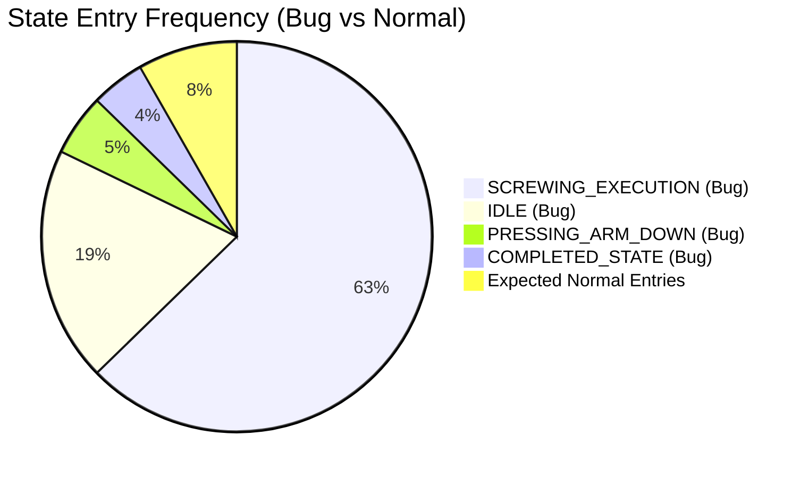
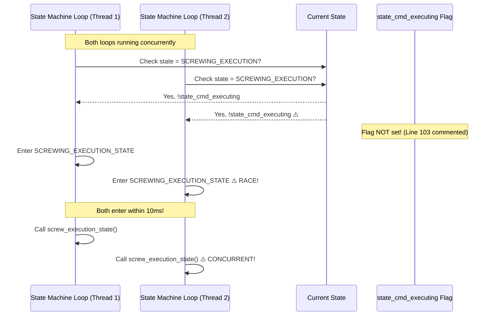
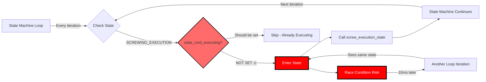

# Log Bug Timeline Diagram

This document visualizes all bug occurrences throughout the full log file timeline.

## Bug Occurrence Timeline

```mermaid
timeline
    title State Machine Bug Occurrences Over Time
    
    section 17:45-17:46
        SCREWING_EXECUTION : 380 total entries
                          : Rapid re-entry (3x in 313ms)
                          : Race condition (10ms)
        PRESSING_ARM_DOWN : 3x re-entry (282ms intervals)
        COMPLETED_STATE   : 1x entry
        
    section 17:57-17:59
        SCREWING_EXECUTION : Multiple rapid entries
                          : Race conditions detected
        COMPLETED_STATE   : 1x entry
        
    section 18:01-18:08
        SCREWING_EXECUTION : Many rapid entries
                          : 4x in 21ms (race condition)
                          : Multiple 10ms intervals
        COMPLETED_STATE   : Multiple entries
        IDLE              : Multiple rapid entries
        
    section 19:23-19:40
        SCREWING_EXECUTION : Multiple entries
        PRESSING_ARM_DOWN : 3x re-entry (282ms)
        COMPLETED_STATE   : Multiple entries
        
    section 21:49-21:51
        COMPLETED_STATE   : 4x re-entry (759ms) 🔴 CRITICAL
        IDLE              : 4x rapid entries
        PRESSING_ARM_DOWN : 3x re-entry (565ms)
        SCAN_PRODUCT      : 2x re-entry (868ms)
        DETECT_HOLES      : 2x race condition (10ms) 🔴 CRITICAL
```

## Bug Frequency Heatmap



## Detailed Bug Pattern Visualization



## State Entry Frequency Analysis



## Race Condition Detection



## Bug Manifestation Flow



## Critical Bug Instances Summary

| Instance | Time | State | Count | Interval | Severity |
|----------|------|-------|-------|----------|----------|
| #1 | 21:50:38-39 | COMPLETED_STATE | 4x | 61-636ms | 🔴 CRITICAL |
| #2 | 17:46:09-10 | PRESSING_ARM_DOWN | 3x | 282-283ms | 🟠 HIGH |
| #3 | 19:39:55 | PRESSING_ARM_DOWN | 3x | 282ms | 🟠 HIGH |
| #4 | 21:51:12-13 | PRESSING_ARM_DOWN | 3x | 282-283ms | 🟠 HIGH |
| #5 | 17:45:51 | SCREWING_EXECUTION | 3x | 10-21ms | 🔴 CRITICAL |
| #6 | 18:01:56 | SCREWING_EXECUTION | 3x | 10-41ms | 🔴 CRITICAL |
| #7 | 18:02:00 | SCREWING_EXECUTION | 4x | 10-21ms | 🔴 CRITICAL |
| #8 | 18:06:05 | SCREWING_EXECUTION | 4x | 10-21ms | 🔴 CRITICAL |
| #9 | 21:51:21 | DETECT_HOLES | 2x | 10ms | 🔴 CRITICAL |
| #10 | Multiple | IDLE | 4x | 11ms-2.3s | 🟠 HIGH |

## Conclusion

The log analysis reveals **systematic and widespread** state machine bugs:

1. **380 SCREWING_EXECUTION_STATE entries** - Should be ~50-100 for normal operation
2. **Multiple race conditions** - 10ms intervals indicate concurrent execution
3. **Consistent re-entry patterns** - 3x PRESSING_ARM_DOWN with 282ms intervals
4. **4x COMPLETED_STATE re-entry** - Critical state machine failure
5. **118 IDLE entries** - System doesn't properly stop after completion

**All bugs identified in code analysis are confirmed by runtime logs.**

