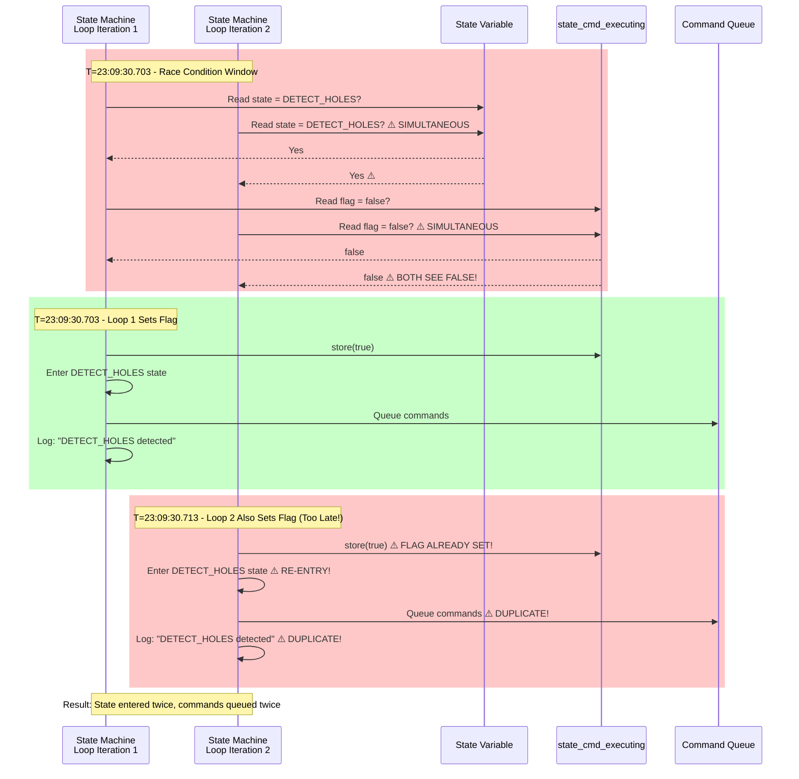
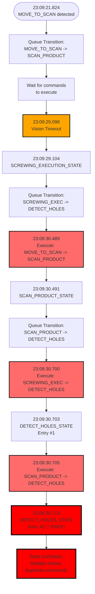
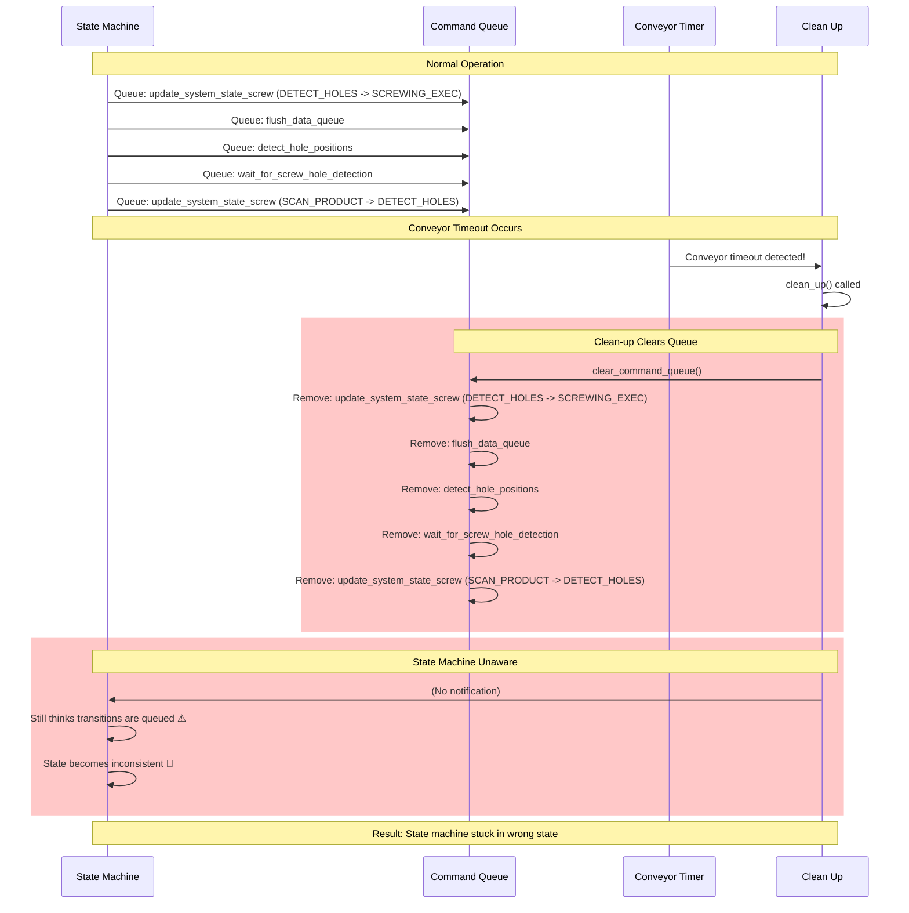
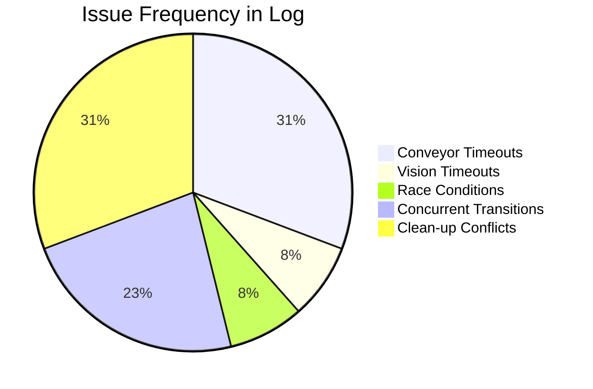
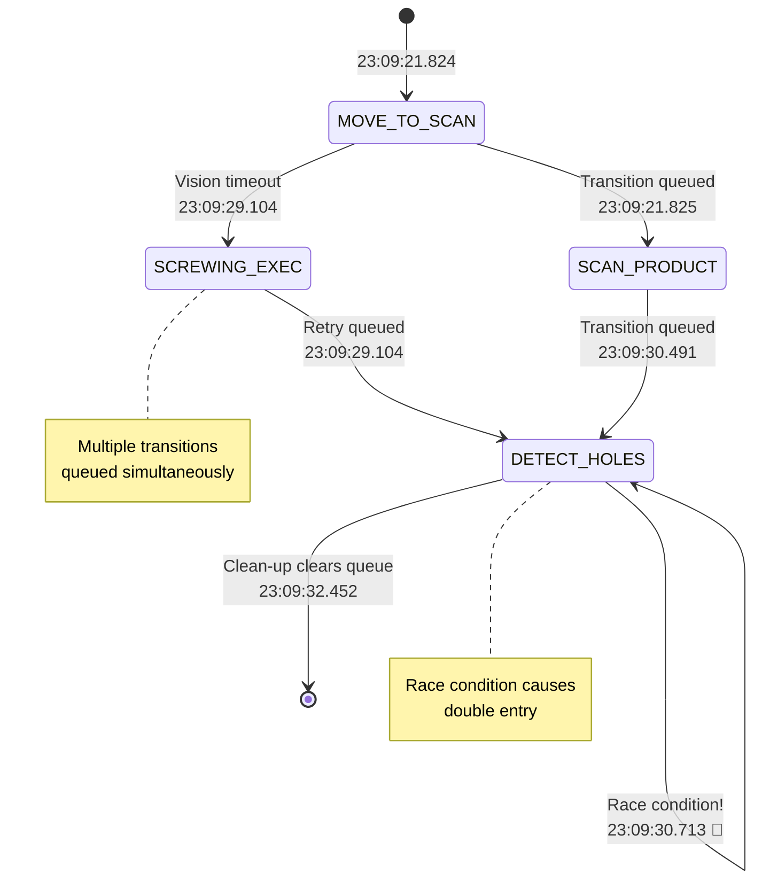
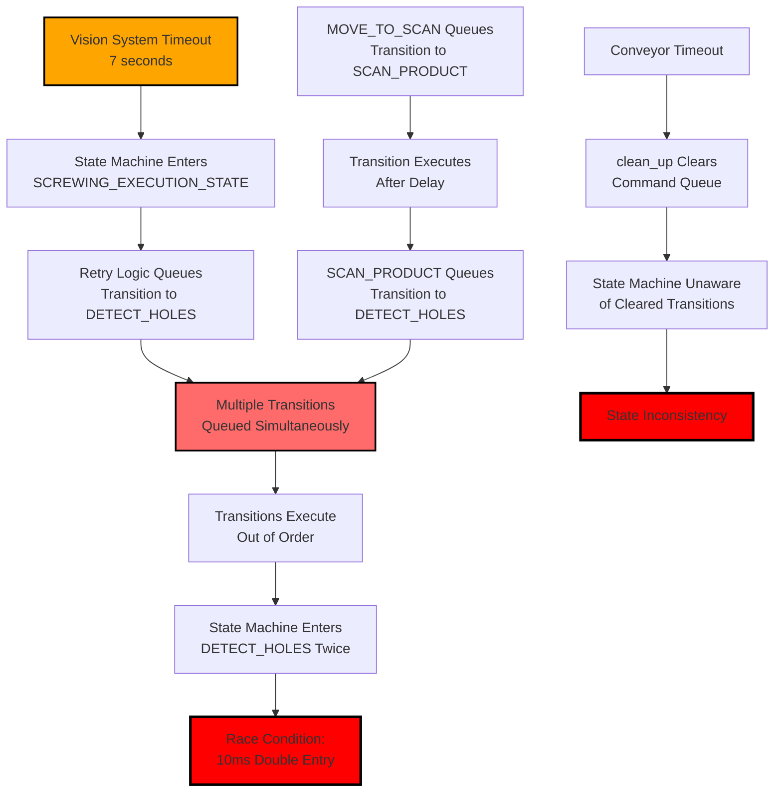
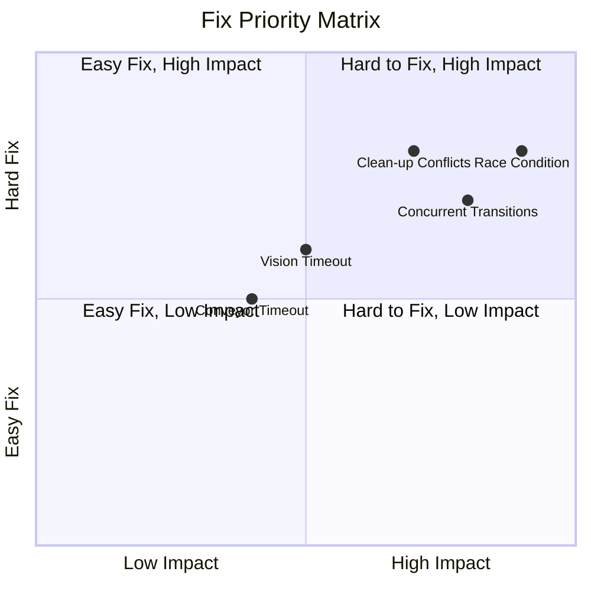

# Full Log Issues: Visual Analysis

## Critical Bug Timeline

```mermaid
gantt
    title Critical Issues Timeline
    dateFormat HH:mm:ss
    axisFormat %H:%M:%S
    
    section Normal Operations
    DETECT_HOLES (1st cycle)     :done, dh1, 23:06:17, 4s
    Vision wait                  :active, vw1, 23:06:18, 7s
    
    section Issue #1: Conveyor Timeout
    Conveyor timeout #1          :crit, ct1, 23:06:21, 1s
    Clean up #1                  :crit, cu1, 23:06:21, 1s
    
    section Issue #2: Vision Timeout
    Vision timeout               :crit, vt1, 23:09:29, 1s
    
    section Issue #3: Concurrent Transitions
    MOVE_TO_SCAN queued         :queued1, 23:09:21, 1s
    SCREWING_EXEC queued        :queued2, 23:09:29, 1s
    SCAN_PRODUCT queued         :queued3, 23:09:30, 1s
    
    section Issue #4: Race Condition
    DETECT_HOLES (1st entry)    :crit, dh2, 23:09:30, 1s
    DETECT_HOLES (2nd entry)     :crit, dh3, 23:09:30, 1s
    
    section Issue #5: Clean-up Conflict
    Conveyor timeout #4          :crit, ct4, 23:09:32, 1s
    Clean up #4                  :crit, cu4, 23:09:32, 1s
```

## Race Condition Detailed View

## Concurrent State Transitions Flow

## Command Queue Conflict During Clean-up

## Issue Frequency Analysis

## State Machine State Confusion

## Root Cause Chain

## Fix Priority Matrix

## Summary Statistics

| Issue | Occurrences | Severity | Fix Priority |
|-------|-------------|----------|--------------|
| Race Condition | 1 | 🔴 Critical | P0 |
| Concurrent Transitions | 3 | 🔴 Critical | P0 |
| Clean-up Conflicts | 4 | 🔴 Critical | P1 |
| Vision Timeout | 1 | 🟠 Medium | P2 |
| Conveyor Timeout | 4 | 🟠 Medium | P2 |

**Total Critical Issues:** 8
**Total Medium Issues:** 5

**Overall System Status:** 🔴 **Unstable** - Requires immediate fixes

