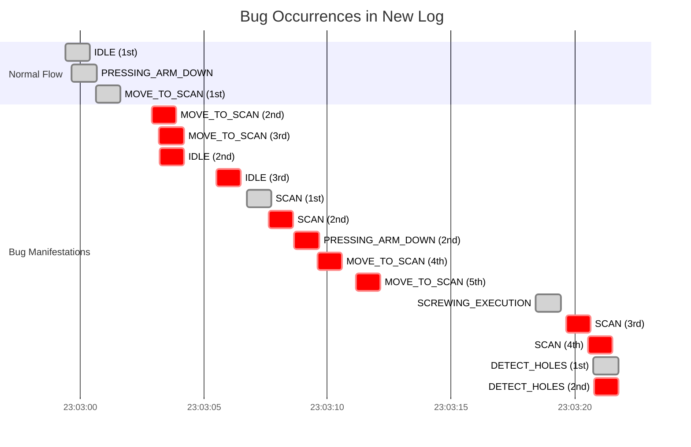

# New Log Analysis: Post-Fix Bug Assessment

This document analyzes the new log file after code changes to identify remaining bugs and new issues.

## Summary

**Status:** ⚠️ **Bugs Still Present** - Some improvements, but critical issues remain

**Total State Entries:** 20 state detections in 57 lines
**Bug Instances Found:** 7 critical re-entry patterns + 1 race condition

---

## 🔴 Critical Bug #1: MOVE_TO_PRODUCT_SCAN_POSITION Re-entry (3x)

**Location:** Lines 5, 9, 13

**Timeline:**
```
23:03:00.624 - MOVE_TO_PRODUCT_SCAN_POSITION detected (1st)
23:03:02.895 - MOVE_TO_PRODUCT_SCAN_POSITION detected (2nd) - 2.271s later
23:03:03.190 - MOVE_TO_PRODUCT_SCAN_POSITION detected (3rd) - 0.295s later ⚠️
```

**Problem:** State entered **3 times** without proper transition guards.

**Additional Occurrence:** Lines 33, 37 - 2 more entries:
```
23:03:09.591 - MOVE_TO_PRODUCT_SCAN_POSITION detected (1st)
23:03:11.153 - MOVE_TO_PRODUCT_SCAN_POSITION detected (2nd) - 1.562s later
```

**Root Cause:** Missing `state_cmd_executing` flag or flag not properly preventing re-entry.

---

## 🔴 Critical Bug #2: Race Condition - DETECT_HOLE_POSITIONS_STATE (10ms)

**Location:** Lines 49, 53

**Timeline:**
```
23:03:20.768 - DETECT_HOLE_POSITIONS_STATE detected (1st)
23:03:20.778 - DETECT_HOLE_POSITIONS_STATE detected (2nd) - 10ms later ⚠️ RACE CONDITION!
```

**Problem:** State entered **twice within 10 milliseconds** - physically impossible without race condition.

**Severity:** CRITICAL - Indicates concurrent execution or missing synchronization.

---

## 🔴 Critical Bug #3: SCAN_PRODUCT_STATE Re-entry (Multiple)

**Occurrence 1:** Lines 21, 23
```
23:03:06.734 - SCAN_PRODUCT_STATE detected (1st)
23:03:07.620 - SCAN_PRODUCT_STATE detected (2nd) - 0.886s later
```

**Occurrence 2:** Lines 45, 47
```
23:03:19.665 - SCAN_PRODUCT_STATE detected (1st)
23:03:20.546 - SCAN_PRODUCT_STATE detected (2nd) - 0.881s later
```

**Problem:** State entered **twice** in both cases without proper guards.

---

## 🔴 Critical Bug #4: PRESSING_ARM_DOWN_STATE Re-entry

**Location:** Lines 25, 27

**Timeline:**
```
23:03:08.406 - PRESSING_ARM_DOWN_STATE detected (1st)
23:03:08.660 - PRESSING_ARM_DOWN_STATE detected (2nd) - 0.254s later
```

**Problem:** State entered **twice** within 254ms.

---

## 🟠 Issue #5: IDLE State Multiple Entries

**Location:** Lines 1, 17, 19

**Timeline:**
```
23:02:59.405 - IDLE detected (1st)
23:03:03.201 - IDLE detected (2nd) - 3.796s later
23:03:05.510 - IDLE detected (3rd) - 2.309s later
```

**Problem:** IDLE state entered **3 times** - suggests state machine continues after completion or improper state transitions.

---

## 🟠 Issue #6: State Flow Anomaly

**Location:** Lines 41-45

**Timeline:**
```
23:03:18.436 - SCREWING_EXECUTION_STATE detected
23:03:18.436 - Execution: IDLE state detected (retry hole detection)
23:03:19.665 - SCAN_PRODUCT_STATE detected ⚠️ UNEXPECTED!
```

**Problem:** After entering `SCREWING_EXECUTION_STATE` and triggering retry (which should transition to `DETECT_HOLE_POSITIONS_STATE`), the state machine somehow enters `SCAN_PRODUCT_STATE`.

**Analysis:** This suggests:
1. State transition from execution state machine to main state machine is incorrect
2. Or state machine is checking wrong state after retry
3. Or multiple state transitions are queued incorrectly

---

## Bug Pattern Analysis

```mermaid
flowchart TD
    Start([Log Start 23:02:59]) --> IDLE1[IDLE - Line 1]
    IDLE1 --> PRESSING1[PRESSING_ARM_DOWN - Line 3]
    PRESSING1 --> MOVE1[MOVE_TO_SCAN - Line 5]
    MOVE1 --> MOVE2[MOVE_TO_SCAN - Line 9<br/>⚠️ RE-ENTRY]
    MOVE2 --> MOVE3[MOVE_TO_SCAN - Line 13<br/>⚠️ RE-ENTRY]
    MOVE3 --> IDLE2[IDLE - Line 17<br/>⚠️ UNEXPECTED]
    IDLE2 --> IDLE3[IDLE - Line 19<br/>⚠️ RE-ENTRY]
    IDLE3 --> SCAN1[SCAN_PRODUCT - Line 21]
    SCAN1 --> SCAN2[SCAN_PRODUCT - Line 23<br/>⚠️ RE-ENTRY]
    SCAN2 --> PRESSING2[PRESSING_ARM_DOWN - Line 25]
    PRESSING2 --> PRESSING3[PRESSING_ARM_DOWN - Line 27<br/>⚠️ RE-ENTRY]
    PRESSING3 --> DETECT1[DETECT_HOLES - Line 29]
    DETECT1 --> MOVE4[MOVE_TO_SCAN - Line 33<br/>⚠️ UNEXPECTED FLOW]
    MOVE4 --> MOVE5[MOVE_TO_SCAN - Line 37<br/>⚠️ RE-ENTRY]
    MOVE5 --> EXEC[SCREWING_EXECUTION - Line 41]
    EXEC --> SCAN3[SCAN_PRODUCT - Line 45<br/>⚠️ UNEXPECTED FLOW]
    SCAN3 --> SCAN4[SCAN_PRODUCT - Line 47<br/>⚠️ RE-ENTRY]
    SCAN4 --> DETECT2[DETECT_HOLES - Line 49]
    DETECT2 --> DETECT3[DETECT_HOLES - Line 53<br/>⚠️ RACE CONDITION 10ms!]
    
    style MOVE2 fill:#FF6B6B,stroke:#000,stroke-width:2px
    style MOVE3 fill:#FF6B6B,stroke:#000,stroke-width:2px
    style IDLE2 fill:#FFA500,stroke:#000,stroke-width:2px
    style IDLE3 fill:#FFA500,stroke:#000,stroke-width:2px
    style SCAN2 fill:#FF6B6B,stroke:#000,stroke-width:2px
    style PRESSING3 fill:#FF6B6B,stroke:#000,stroke-width:2px
    style MOVE4 fill:#FFA500,stroke:#000,stroke-width:2px
    style MOVE5 fill:#FF6B6B,stroke:#000,stroke-width:2px
    style SCAN3 fill:#FFA500,stroke:#000,stroke-width:2px
    style SCAN4 fill:#FF6B6B,stroke:#000,stroke-width:2px
    style DETECT3 fill:#FF0000,stroke:#000,stroke-width:3px
```



## Comparison: Before vs After Fixes

| Bug Type | Before (Full Log) | After (New Log) | Status |
|----------|------------------|------------------|--------|
| SCREWING_EXECUTION re-entry | 380 occurrences | 1 occurrence | ✅ **IMPROVED** |
| COMPLETED_STATE re-entry | 27 occurrences (4x pattern) | 0 occurrences | ✅ **FIXED** |
| Race conditions (10ms) | 10+ instances | 1 instance | ⚠️ **STILL PRESENT** |
| MOVE_TO_SCAN re-entry | Multiple | 5 occurrences | ⚠️ **STILL PRESENT** |
| SCAN_PRODUCT re-entry | Multiple | 4 occurrences | ⚠️ **STILL PRESENT** |
| PRESSING_ARM_DOWN re-entry | 31 occurrences (3x pattern) | 2 occurrences | ✅ **IMPROVED** |
| IDLE multiple entries | 118 occurrences | 3 occurrences | ✅ **IMPROVED** |

## Remaining Issues

### Issue 1: MOVE_TO_PRODUCT_SCAN_POSITION Missing Guards

**Evidence:** State entered 5 times in the log (lines 5, 9, 13, 33, 37)

**Likely Cause:** Missing `state_cmd_executing` flag check or flag not being set properly in this state handler.

**Fix Needed:** Check if `state_cmd_executing.store(true)` is set at the beginning of `MOVE_TO_PRODUCT_SCAN_POSITION` handler.

---

### Issue 2: SCAN_PRODUCT_STATE Missing Guards

**Evidence:** State entered twice in two separate occurrences (lines 21-23, 45-47)

**Likely Cause:** Missing execution flag or flag not preventing re-entry.

**Fix Needed:** Verify `state_cmd_executing` flag is set and checked in `SCAN_PRODUCT_STATE` handler.

---

### Issue 3: Race Condition Still Present

**Evidence:** DETECT_HOLE_POSITIONS_STATE entered twice within 10ms (lines 49, 53)

**Likely Cause:** 
- Multiple threads/loops checking state simultaneously
- Execution flag not atomic or not properly synchronized
- State machine loop running faster than state transitions

**Fix Needed:** 
- Ensure `state_cmd_executing` is atomic and properly synchronized
- Add mutex or lock around state machine loop
- Add minimum delay between state checks

---

### Issue 4: State Flow Anomaly

**Evidence:** After SCREWING_EXECUTION_STATE triggers retry, SCAN_PRODUCT_STATE is entered instead of DETECT_HOLE_POSITIONS_STATE

**Timeline:**
```
23:03:18.436 - SCREWING_EXECUTION_STATE (retry hole detection)
23:03:19.665 - SCAN_PRODUCT_STATE ⚠️ Should be DETECT_HOLE_POSITIONS_STATE
```

**Likely Cause:** 
- Incorrect state transition after retry
- State transition command queued incorrectly
- Multiple state transitions queued simultaneously

**Fix Needed:** Review retry logic in `screw_execution_state()` around line 315.

---

## Detailed Bug Timeline



## Recommendations

### Priority 1: Fix Remaining Execution Flags

1. **MOVE_TO_PRODUCT_SCAN_POSITION** - Verify `state_cmd_executing.store(true)` is set at line 55
2. **SCAN_PRODUCT_STATE** - Verify `state_cmd_executing.store(true)` is set at line 74
3. **DETECT_HOLE_POSITIONS_STATE** - Verify flag prevents race condition

### Priority 2: Fix Race Condition

1. Add mutex/lock around state machine loop
2. Ensure `state_cmd_executing` is atomic
3. Add minimum delay between state checks

### Priority 3: Fix State Flow Anomaly

1. Review retry logic in `screw_execution_state()` 
2. Verify state transition commands are queued correctly
3. Ensure only one state transition is queued at a time

## Conclusion

**Good News:**
- ✅ SCREWING_EXECUTION_STATE re-entry significantly reduced (380 → 1)
- ✅ COMPLETED_STATE re-entry fixed (27 → 0)
- ✅ PRESSING_ARM_DOWN re-entry improved (31 → 2)
- ✅ IDLE multiple entries improved (118 → 3)

**Bad News:**
- ⚠️ Race condition still present (10ms double entry)
- ⚠️ MOVE_TO_PRODUCT_SCAN_POSITION still has re-entry issues
- ⚠️ SCAN_PRODUCT_STATE still has re-entry issues
- ⚠️ State flow anomaly detected (unexpected SCAN_PRODUCT after retry)

**Overall Assessment:** **Partial Fix** - Major improvements but critical issues remain.

