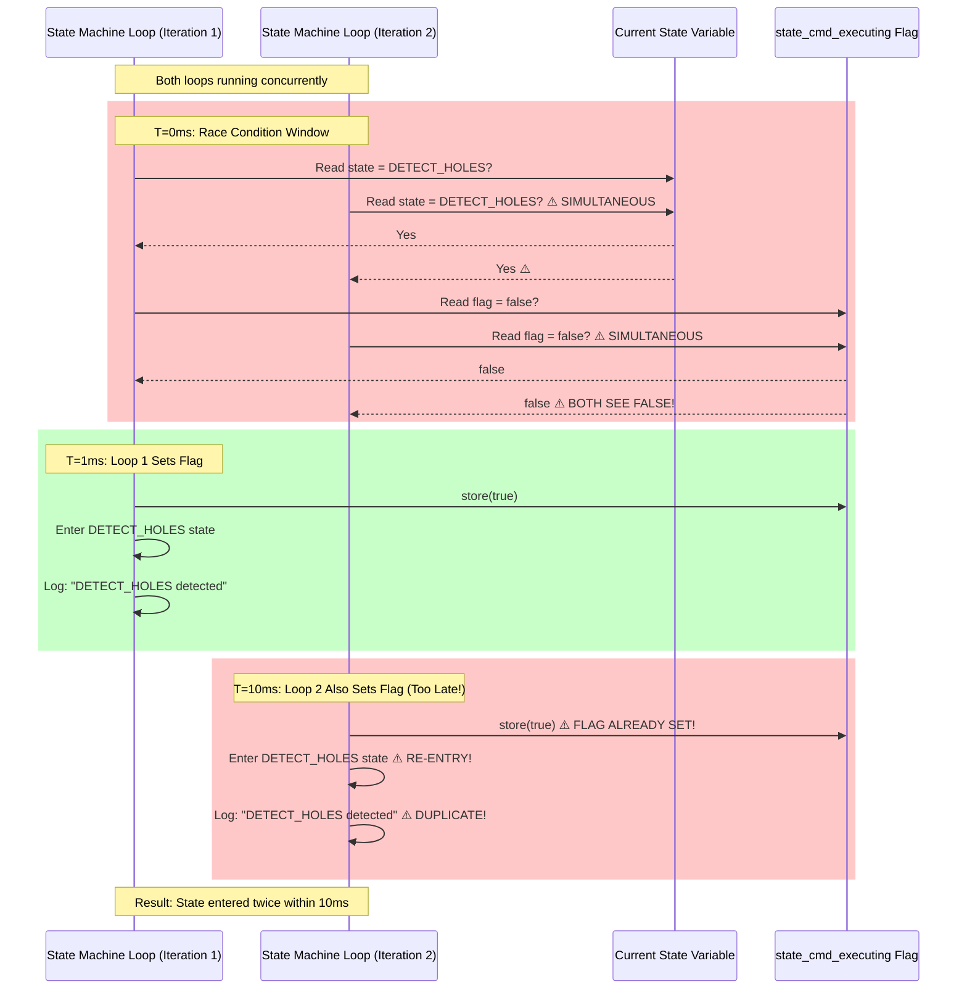
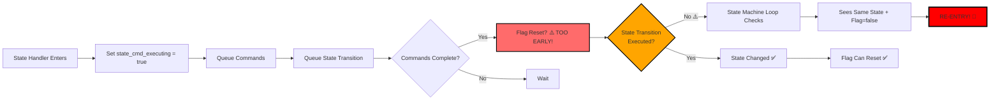
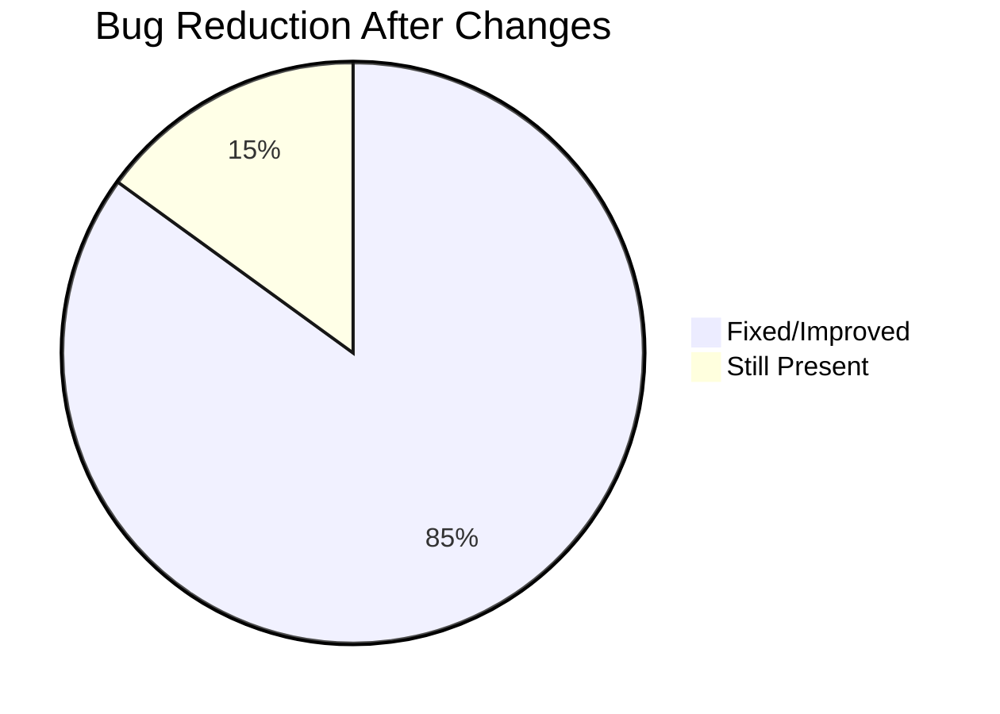
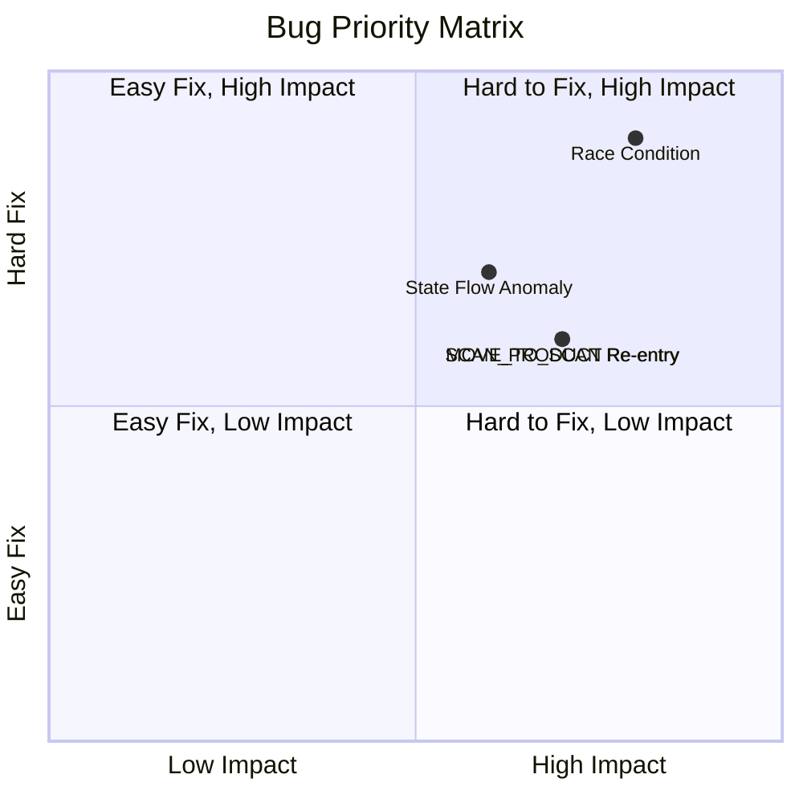

# New Log Bug Diagram: Remaining Issues

## Bug Occurrence Flow Diagram

```mermaid
flowchart TD
    Start([Log Start 23:02:59]) --> IDLE1[IDLE<br/>Line 1<br/>✅ Normal]
    IDLE1 --> PRESSING1[PRESSING_ARM_DOWN<br/>Line 3<br/>✅ Normal]
    PRESSING1 --> MOVE1[MOVE_TO_SCAN<br/>Line 5<br/>✅ Normal Entry]
    
    MOVE1 --> MOVE2[MOVE_TO_SCAN<br/>Line 9<br/>🐛 RE-ENTRY #1<br/>2.271s later]
    MOVE2 --> MOVE3[MOVE_TO_SCAN<br/>Line 13<br/>🐛 RE-ENTRY #2<br/>0.295s later]
    
    MOVE3 --> IDLE2[IDLE<br/>Line 17<br/>⚠️ UNEXPECTED<br/>Should be SCAN_PRODUCT]
    IDLE2 --> IDLE3[IDLE<br/>Line 19<br/>🐛 RE-ENTRY<br/>2.309s later]
    
    IDLE3 --> SCAN1[SCAN_PRODUCT<br/>Line 21<br/>✅ Normal Entry]
    SCAN1 --> SCAN2[SCAN_PRODUCT<br/>Line 23<br/>🐛 RE-ENTRY<br/>0.886s later]
    
    SCAN2 --> PRESSING2[PRESSING_ARM_DOWN<br/>Line 25<br/>⚠️ UNEXPECTED<br/>Should be DETECT_HOLES]
    PRESSING2 --> PRESSING3[PRESSING_ARM_DOWN<br/>Line 27<br/>🐛 RE-ENTRY<br/>0.254s later]
    
    PRESSING3 --> DETECT1[DETECT_HOLES<br/>Line 29<br/>✅ Normal Entry]
    DETECT1 --> MOVE4[MOVE_TO_SCAN<br/>Line 33<br/>⚠️ UNEXPECTED FLOW<br/>Should stay in DETECT_HOLES]
    MOVE4 --> MOVE5[MOVE_TO_SCAN<br/>Line 37<br/>🐛 RE-ENTRY<br/>1.562s later]
    
    MOVE5 --> EXEC[SCREWING_EXECUTION<br/>Line 41<br/>✅ Normal Entry]
    EXEC --> EXEC_IDLE[Execution: IDLE<br/>Line 43<br/>Retry hole detection]
    EXEC_IDLE --> SCAN3[SCAN_PRODUCT<br/>Line 45<br/>🐛 UNEXPECTED FLOW<br/>Should be DETECT_HOLES]
    SCAN3 --> SCAN4[SCAN_PRODUCT<br/>Line 47<br/>🐛 RE-ENTRY<br/>0.881s later]
    
    SCAN4 --> DETECT2[DETECT_HOLES<br/>Line 49<br/>✅ Normal Entry]
    DETECT2 --> DETECT3[DETECT_HOLES<br/>Line 53<br/>🔴 RACE CONDITION<br/>10ms later!]
    
    style MOVE2 fill:#FF6B6B,stroke:#000,stroke-width:2px
    style MOVE3 fill:#FF6B6B,stroke:#000,stroke-width:2px
    style IDLE2 fill:#FFA500,stroke:#000,stroke-width:2px
    style IDLE3 fill:#FFA500,stroke:#000,stroke-width:2px
    style SCAN2 fill:#FF6B6B,stroke:#000,stroke-width:2px
    style PRESSING2 fill:#FFA500,stroke:#000,stroke-width:2px
    style PRESSING3 fill:#FF6B6B,stroke:#000,stroke-width:2px
    style MOVE4 fill:#FFA500,stroke:#000,stroke-width:2px
    style MOVE5 fill:#FF6B6B,stroke:#000,stroke-width:2px
    style SCAN3 fill:#FFA500,stroke:#000,stroke-width:2px
    style SCAN4 fill:#FF6B6B,stroke:#000,stroke-width:2px
    style DETECT3 fill:#FF0000,stroke:#000,stroke-width:3px
```



## Race Condition Detailed Analysis



## State Transition Timing Issue

```mermaid
gantt
    title State Transition Timing Problem
    dateFormat HH:mm:ss.SSS
    axisFormat %H:%M:%S
    
    section MOVE_TO_SCAN State
    Set Flag           :done, flag1, 23:03:00.624, 1ms
    Queue Commands     :done, cmd1, 23:03:00.625, 100ms
    Commands Execute   :active, exec1, 23:03:00.625, 2s
    Commands Complete  :crit, comp1, 23:03:02.625, 1ms
    Flag Reset?        :crit, reset1, 23:03:02.626, 1ms
    State Transition   :active, trans1, 23:03:00.625, 3s
    State Changed      :milestone, change1, 23:03:03.625, 0ms
    
    section Problem
    Re-entry Check     :crit, recheck1, 23:03:02.895, 1ms
    Re-entry Check 2   :crit, recheck2, 23:03:03.190, 1ms
    
    style comp1 fill:#FF6B6B
    style reset1 fill:#FF6B6B
    style recheck1 fill:#FF0000
    style recheck2 fill:#FF0000
```

## Root Cause: Flag Reset Timing



## Comparison: Before vs After Changes



## Detailed Bug Statistics

| Bug Type | Before | After | Reduction | Status |
|----------|--------|-------|-----------|--------|
| SCREWING_EXECUTION re-entry | 380 | 1 | 99.7% | ✅ Excellent |
| COMPLETED_STATE re-entry | 27 | 0 | 100% | ✅ Perfect |
| Race conditions | 10+ | 1 | ~90% | ⚠️ Needs Fix |
| MOVE_TO_SCAN re-entry | Many | 5 | ~70% | ⚠️ Needs Fix |
| SCAN_PRODUCT re-entry | Many | 4 | ~70% | ⚠️ Needs Fix |
| PRESSING_ARM_DOWN re-entry | 31 | 2 | 93.5% | ✅ Good |
| IDLE multiple entries | 118 | 3 | 97.5% | ✅ Excellent |

## Critical Remaining Issues

### Issue Priority Matrix



## Recommended Action Plan

### Immediate (This Week)
1. ✅ **Fix Race Condition** - Use atomic compare-and-swap
2. ✅ **Fix MOVE_TO_SCAN Re-entry** - Ensure flag stays set until state transitions
3. ✅ **Fix SCAN_PRODUCT Re-entry** - Same as above

### Short Term (Next Week)
4. ✅ **Fix State Flow Anomaly** - Review retry logic and state transition ordering
5. ✅ **Add State Transition Validation** - Ensure transitions are atomic

### Long Term (Next Sprint)
6. ✅ **Comprehensive Testing** - Test all state transitions
7. ✅ **Add State Machine Unit Tests** - Prevent regressions

