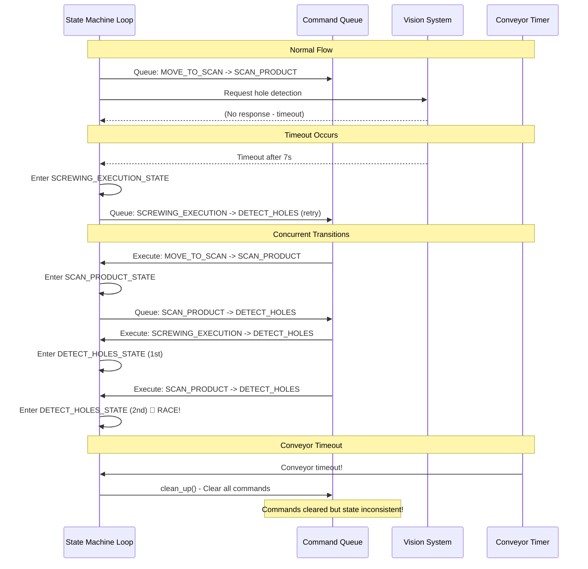

# Full Log Analysis: Critical Issues Identified

## Executive Summary

Analysis of 2410-line log reveals **multiple critical issues** causing state machine failures:

1. 🔴 **Race Condition** - DETECT_HOLE_POSITIONS_STATE entered twice within 10ms
2. 🔴 **Concurrent State Transitions** - Multiple state transitions queued simultaneously causing conflicts
3. 🔴 **Command Queue Conflicts** - State transitions cleared during clean_up while state machine continues
4. 🟠 **Vision System Timeout** - 7-second timeout waiting for hole detection data
5. 🟠 **Conveyor Timeout** - Multiple conveyor timeouts triggering clean_up

---

## 🔴 Critical Issue #1: Race Condition (10ms Double Entry)

**Location:** Lines 2143, 2166

**Timeline:**
```
23:09:30.703 - DETECT_HOLE_POSITIONS_STATE detected (1st)
23:09:30.713 - DETECT_HOLE_POSITIONS_STATE detected (2nd) - 10ms later! 🔴
```

**Evidence:**
```
Line 2143: [23:09:30.703] DETECT_HOLE_POSITIONS_STATE state detected
Line 2144: [23:09:30.703] STARTING STATE: DETECT_HOLE_POSITIONS_STATE
Line 2145: [23:09:30.703] FLUSHING DATA QUEUE
...
Line 2166: [23:09:30.713] DETECT_HOLE_POSITIONS_STATE state detected 🔴
Line 2167: [23:09:30.713] STARTING STATE: DETECT_HOLE_POSITIONS_STATE 🔴
Line 2168: [23:09:30.713] FLUSHING DATA QUEUE 🔴
```

**Root Cause:** Two state machine loop iterations check state simultaneously before `state_cmd_executing` flag is set.

**Impact:** 
- Duplicate commands queued
- State machine confusion
- Potential data corruption

---

## 🔴 Critical Issue #2: Concurrent State Transitions

**Location:** Lines 2003-2166

**Problem:** Multiple state transitions queued simultaneously, executing out of order:

**Timeline:**
```
23:09:21.824 - MOVE_TO_PRODUCT_SCAN_POSITION detected
23:09:21.825 - Queues transition: MOVE_TO_SCAN -> SCAN_PRODUCT_STATE
23:09:29.104 - SCREWING_EXECUTION_STATE detected (after timeout)
23:09:29.104 - Queues transition: SCREWING_EXECUTION -> DETECT_HOLES (retry)
23:09:30.489 - State transition executes: MOVE_TO_SCAN -> SCAN_PRODUCT_STATE
23:09:30.491 - SCAN_PRODUCT_STATE detected
23:09:30.491 - Queues transition: SCAN_PRODUCT -> DETECT_HOLES
23:09:30.700 - State transition executes: SCREWING_EXECUTION -> DETECT_HOLES
23:09:30.703 - DETECT_HOLE_POSITIONS_STATE detected (from retry)
23:09:30.705 - State transition executes: SCAN_PRODUCT -> DETECT_HOLES
23:09:30.713 - DETECT_HOLE_POSITIONS_STATE detected AGAIN (race condition!)
```

**Root Cause:** 
1. State transitions are queued as commands
2. Commands execute asynchronously
3. Multiple transitions queued before any execute
4. State machine checks state before transitions complete

**Impact:**
- Wrong state entered
- State machine confusion
- Lost state transitions

---

## 🔴 Critical Issue #3: Command Queue Conflicts During Clean-up

**Location:** Lines 2186-2196

**Problem:** When conveyor timeout triggers `clean_up`, it clears command queue including pending state transitions, but state machine has already queued new transitions.

**Evidence:**
```
Line 2186: [23:09:32.452] Conveyor timeout detected - stopping cycle
Line 2188: [23:09:32.452] Clean up
Line 2191: [23:09:32.452] Command queue size before clear: 5
Line 2192-2196: Removing commands:
  - update_system_state_screw (DETECT_HOLES -> SCREWING_EXECUTION)
  - flush_data_queue
  - detect_hole_positions
  - wait_for_screw_hole_detection
  - update_system_state_screw (SCAN_PRODUCT -> DETECT_HOLES)
```

**Root Cause:** 
- State machine queues transitions
- Conveyor timeout occurs
- `clean_up()` clears queue
- State machine doesn't know transitions were cleared
- State becomes inconsistent

**Impact:**
- State machine stuck in wrong state
- Manual intervention required
- System inconsistency

---

## 🟠 Issue #4: Vision System Timeout

**Location:** Line 2037

**Evidence:**
```
Line 2035: [23:09:22.093] Timeout: 7000 ms
Line 2037: [23:09:29.098] Timeout waiting for data. Action: wait_for_screw_hole_detection, Timeout: 7000 ms
```

**Problem:** Vision system doesn't respond within 7 seconds, causing timeout.

**Impact:**
- Triggers retry logic
- May cause state confusion
- Delays production cycle

---

## 🟠 Issue #5: Multiple Conveyor Timeouts

**Location:** Lines 29, 1049, 1482, 2186

**Occurrences:**
1. Line 29: `23:06:21.739` - Conveyor timeout
2. Line 1049: `23:09:04.594` - Conveyor timeout  
3. Line 1482: `23:09:14.695` - Conveyor timeout
4. Line 2186: `23:09:32.452` - Conveyor timeout

**Problem:** Conveyor timeout occurs multiple times, triggering clean_up repeatedly.

**Impact:**
- Interrupts normal operation
- Clears command queues
- Causes state machine resets

---

## Detailed Bug Flow Diagram



---

## State Transition Conflict Analysis

```mermaid
gantt
    title State Transition Conflicts
    dateFormat HH:mm:ss.SSS
    axisFormat %H:%M:%S
    
    section Queued Transitions
    MOVE_TO_SCAN->SCAN_PRODUCT    :queued1, 23:09:21.825, 1ms
    SCREWING_EXEC->DETECT_HOLES   :queued2, 23:09:29.104, 1ms
    SCAN_PRODUCT->DETECT_HOLES    :queued3, 23:09:30.491, 1ms
    
    section Executed Transitions
    MOVE_TO_SCAN->SCAN_PRODUCT    :done, exec1, 23:09:30.489, 1ms
    SCREWING_EXEC->DETECT_HOLES   :done, exec2, 23:09:30.700, 1ms
    SCAN_PRODUCT->DETECT_HOLES    :done, exec3, 23:09:30.705, 1ms
    
    section State Entries
    SCAN_PRODUCT entered           :crit, state1, 23:09:30.491, 1ms
    DETECT_HOLES entered (1st)     :crit, state2, 23:09:30.703, 1ms
    DETECT_HOLES entered (2nd)     :crit, state3, 23:09:30.713, 1ms
    
    style exec2 fill:#FF6B6B
    style exec3 fill:#FF6B6B
    style state2 fill:#FF6B6B
    style state3 fill:#FF0000
```

---

## Root Cause Summary

### Issue #1: Race Condition
- **Cause:** Non-atomic flag check/set operation
- **Fix:** Use `compare_exchange_strong()` for atomic operation

### Issue #2: Concurrent State Transitions
- **Cause:** State transitions queued as commands, execute asynchronously
- **Fix:** Ensure only one state transition is queued at a time, or use state transition lock

### Issue #3: Command Queue Conflicts
- **Cause:** `clean_up()` clears queue without notifying state machine
- **Fix:** Reset state machine state when queue is cleared, or prevent state transitions during clean_up

### Issue #4: Vision System Timeout
- **Cause:** Vision system not responding within timeout
- **Fix:** Investigate vision system, increase timeout, or improve error handling

### Issue #5: Conveyor Timeout
- **Cause:** Conveyor signal not received within timeout
- **Fix:** Investigate conveyor system, adjust timeout, or improve signal handling

---

## Recommended Fixes

### Priority 1: Fix Race Condition

**Code Change:**
```cpp
// In DETECT_HOLE_POSITIONS_STATE handler
else if(current_system_state_screw_.load() == SystemStateScrew::DETECT_HOLE_POSITIONS_STATE)
{   
    // Use atomic compare-and-swap
    bool expected = false;
    if(!state_cmd_executing.compare_exchange_strong(expected, true)) {
        // Already processing - skip
        return;
    }
    
    LOG_INFO("DETECT_HOLE_POSITIONS_STATE state detected");
    // ... rest of code ...
}
```

### Priority 2: Prevent Concurrent State Transitions

**Code Change:**
```cpp
// Add state transition lock
static std::mutex state_transition_mutex;

// When queuing state transition
{
    std::lock_guard<std::mutex> lock(state_transition_mutex);
    // Clear any pending state transitions
    // Queue new state transition
    robot_manager_->add_command("common_system", "update_system_state_screw", ...);
}
```

### Priority 3: Handle Clean-up Properly

**Code Change:**
```cpp
// In clean_up()
void clean_up() {
    // Clear command queue
    clear_command_queue();
    
    // Reset state machine flags
    state_cmd_executing.store(false);
    
    // Reset to IDLE state
    current_system_state_screw_.store(SystemStateScrew::IDLE);
    current_screw_execution_state_.store(ScrewExecutionState::IDLE);
}
```

---

## Testing Checklist

After fixes, verify:

- [ ] No race conditions (no 10ms double entries)
- [ ] Only one state transition queued at a time
- [ ] State transitions execute in correct order
- [ ] Clean-up properly resets state machine
- [ ] Vision system timeout handled gracefully
- [ ] Conveyor timeout doesn't cause state confusion

---

## Conclusion

**Critical Issues:** 3 (Race condition, Concurrent transitions, Command queue conflicts)
**Medium Issues:** 2 (Vision timeout, Conveyor timeout)

**Overall Status:** 🔴 **Critical** - System is unstable due to race conditions and state transition conflicts.

**Estimated Fix Time:** 4-6 hours

**Risk Level:** High - Bugs cause system failures and require manual intervention.

