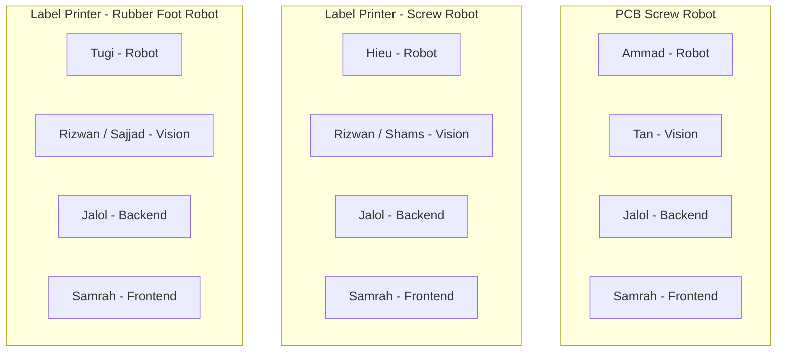
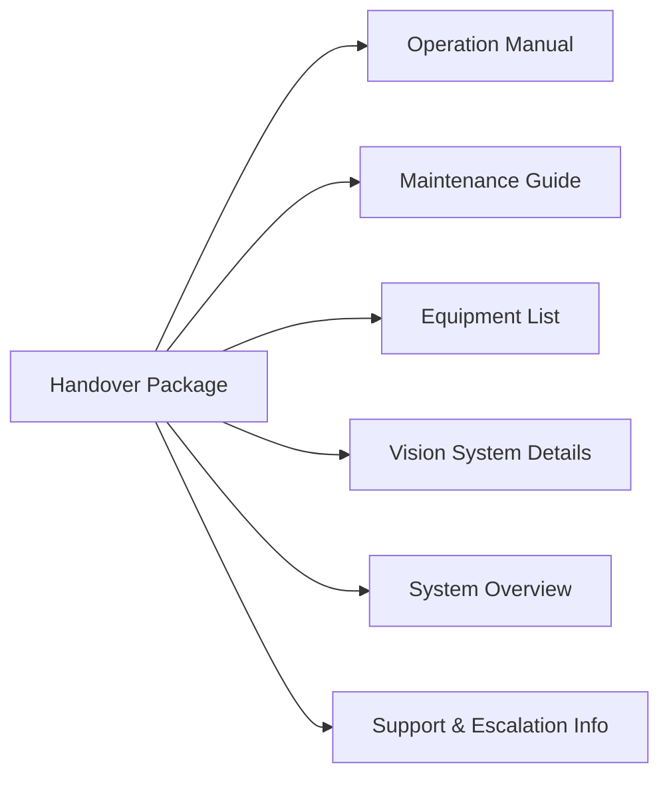
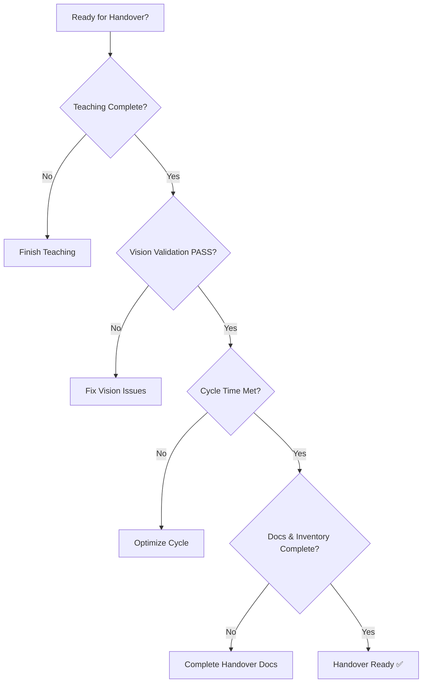

# Team Structure & Handover

## Team Structure and Ownership

**Cross-Cutting Roles**
- Shoaib: Project manager (recently joined to manage all teams), coordination, acceptance, handover
- Saad: Robot team lead
- Odil: Vision team lead
- Kwanghyeop: Local Korean engineer, supports local tasks requiring Korean language, documentation assistance
- Muazzam: Hardware support

**Note:** PCB system team members (Ammad, Tan) are currently helping other robot systems (Hieu, Tugi) as PCB system is almost complete.

---

## Documentation & Handover Package

**Handover Includes**
- System startup and shutdown
- Normal operation procedures
- Warning and recovery behavior
- Preventive maintenance
- Installed equipment inventory (robots, controllers, cameras)
- Camera and lighting setup
- Support ownership and escalation path

---

## Current Focus Areas

- Completion of robot teaching where still in progress
- Vision model validation and reporting
- Cycle time optimization and confirmation
- Documentation and inventory completion
- Internal acceptance review and evidence collection

---

## Definition of "Done"

A system is considered ready for handover when:

---

[← Back to Overview](./README.md)

