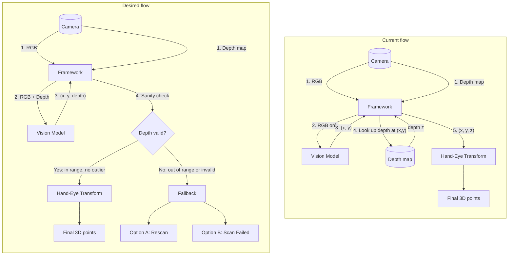
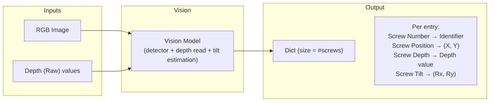

# Vision Pipeline: Current vs Desired Flow

## Summary

| | Current | Desired |
|---|--------|--------|
| **Input to Vision Model** | RGB only | RGB + Depth |
| **Who provides depth at (x,y)?** | Framework (lookup on depth map) | Vision model (predicts x, y, depth) |
| **Depth validation** | None | Sanity check (range, outliers) before hand-eye |
| **If depth invalid** | N/A | Fallback: depth-map lookup at (x,y) or reject |

---

## Flowchart

---

## Step-by-step

### Current flow

1. **Camera** outputs RGB image and depth map.
2. **Framework** sends only **RGB** to the vision model.
3. **Vision model** returns **(x, y)** in image space.
4. **Framework** reads **depth z** at (x, y) from the depth map.
5. **Framework** passes **(x, y, z)** to hand-eye transformation → **final 3D points**.

### Desired flow

1. **Camera** outputs RGB image and depth map.
2. **Framework** sends **RGB + Depth** to the vision model.
3. **Vision model** returns **(x, y, depth)** (depth comes from the model, not the map).
4. **Framework** runs a **depth sanity check** (range, invalid, outlier).
5. **If valid:** (x, y, z) → hand-eye transformation → **final 3D points**.
6. **If invalid:** **Fallback** — either get depth from the map at (x, y) or reject the point.

---

## What changes

- **Vision model** is depth-aware: it gets RGB + depth and outputs x, y, and depth.
- **Depth source** shifts from “always from depth map” to “from model, validated; fallback to map or reject.”
- **Validation** step ensures depth is in range and not an outlier before hand-eye transform.

---

## Vision I/O Diagram (RGB + Raw Depth → Screw Dict)

High-level inputs and output of the vision stage: RGB and raw depth go in; a per-screw dictionary comes out.

